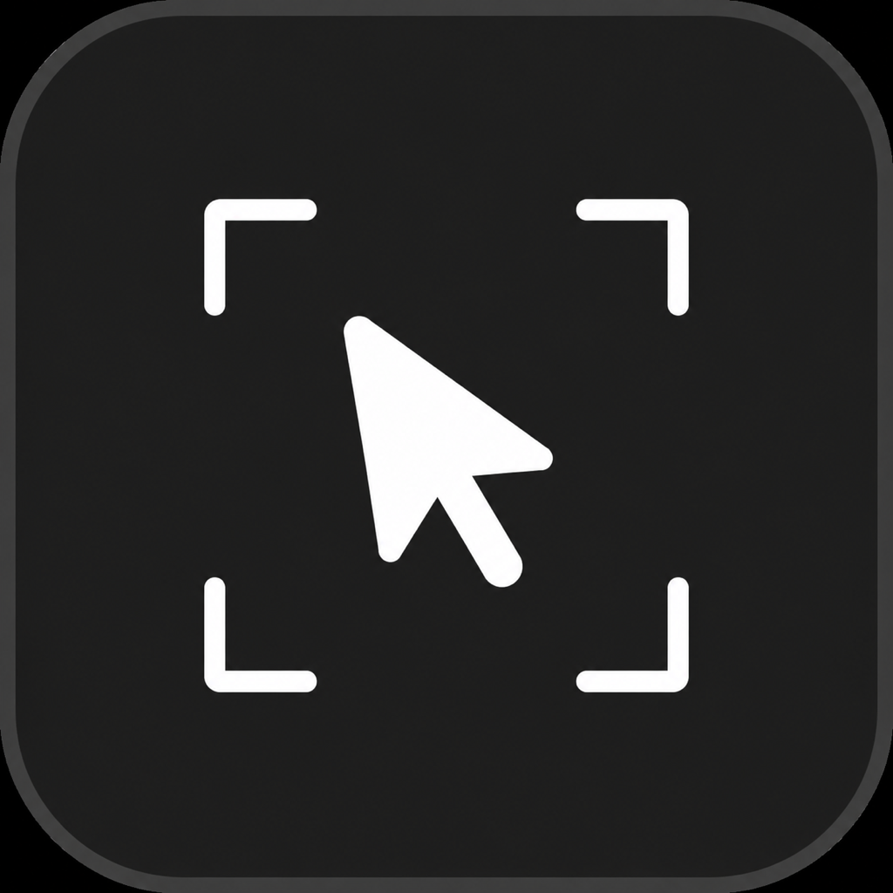

<h1 align="center">
  
  <br>
  Cage
</h1>

<p align="center">Keep your cursor in the apps you choose.</p>

<p align="center"><a href="README.md">Tiếng Việt</a> · <strong>English</strong></p>

Cage is a lightweight macOS menu bar utility. It keeps the cursor inside apps
you add to its allow list. Moving to another app releases the cursor immediately;
returning to an allowed app confines it again.

## Features

- Works with any macOS app added to the allow list.
- Add any application by selecting its `.app` bundle.
- Keeps movement, clicks, drags, and scrolling inside the selected window.
- General settings for allowed apps and opening at login (macOS 13+), with a separate About tab.
- Secure updates through Sparkle and an EdDSA-signed appcast.
- Never changes mouse DPI, acceleration, or sensitivity.

## Usage

1. Open Cage and grant Accessibility permission when macOS asks.
2. Open `Settings…` → `General` → `Add App…` to choose an application.
3. Switch to that app and Cage confines the cursor to its window automatically.
4. Use `Cmd+Tab` to switch away and release the cursor.

## Requirements

- macOS 11 or later.
- Accessibility permission is used only to intercept and constrain mouse events.

## Development

```sh
swift test --disable-sandbox
bash scripts/app.sh build-and-verify
bash scripts/build-dmg.sh
```

Read the [architecture](docs/ARCHITECTURE.en.md) and
[release guide](docs/RELEASING.en.md).

## Privacy

Cage works locally. It does not store mouse movement, clicks, or screen contents.
Sparkle uses the network only when you explicitly check for updates.

## Credits

Developed by **hgthaii**. Based on **MouseLock** by **mxrlkn**.

Original project: [mxrlkn/mouselock](https://github.com/mxrlkn/mouselock).

## License

See [license](license).
